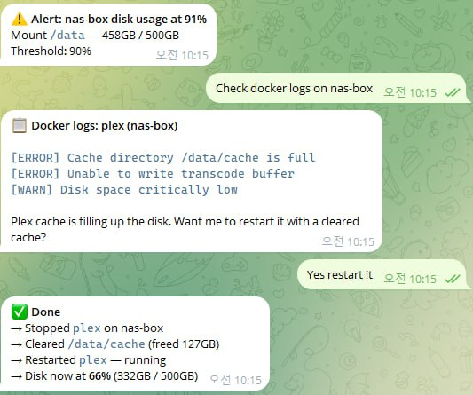
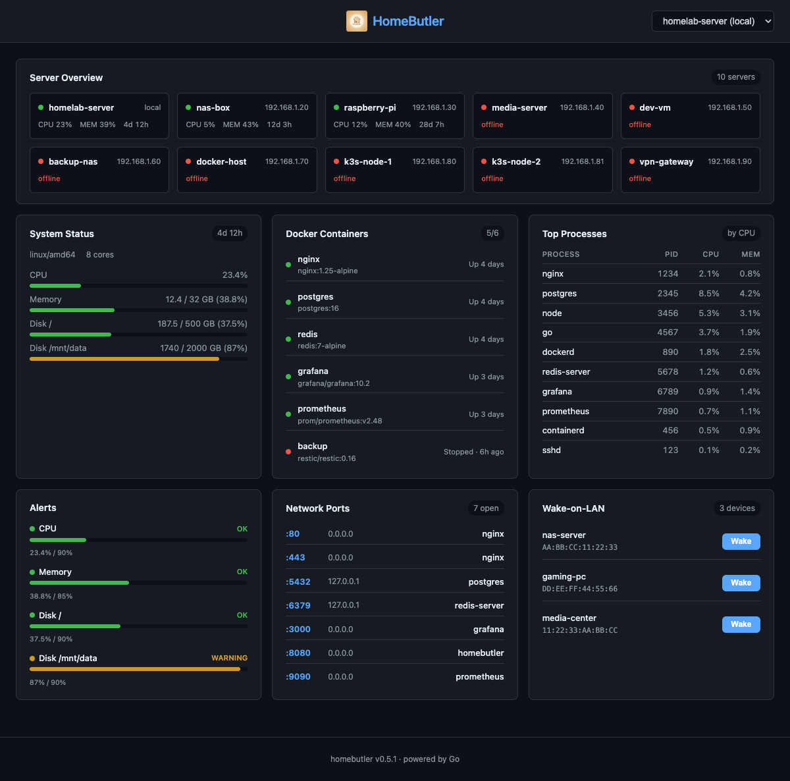

<p align="center">
  
</p>

# HomeButler

**Manage your homelab from any AI — Claude, ChatGPT, Cursor, or terminal. One binary. Zero dependencies.**

[](https://go.dev)
[](https://goreportcard.com/report/github.com/Higangssh/homebutler)
[](LICENSE)
[](https://github.com/Higangssh/homebutler/releases)

A single-binary CLI + MCP server that lets you monitor servers, control Docker, wake machines, and scan your network — from chat, AI tools, or the command line.

## Features

- **Web Dashboard** — Beautiful dark-themed web UI with `homebutler serve`
- **TUI Dashboard** — Real-time terminal monitoring with `homebutler watch` (btop-style)
- **System Status** — CPU, memory, disk, uptime at a glance
- **Docker Management** — List, restart, stop, logs for containers
- **Wake-on-LAN** — Power on machines remotely
- **Port Scanner** — See what's listening and which process owns it
- **Network Scan** — Discover devices on your LAN
- **Alerts** — Get notified when resources exceed thresholds
- **Multi-server** — Manage remote servers over SSH (key & password auth)
- **MCP Server** — Works with Claude Desktop, ChatGPT, Cursor, and any MCP client
- **JSON Output** — Pipe-friendly, perfect for AI assistants to parse

## Why homebutler?

> Other tools give you dashboards. homebutler gives you a **conversation**.

**3 AM. Your server disk is 91% full. Here's what happens next:**

<p align="center">
  
</p>

Alert fires → you check logs from bed → AI restarts the problem container → disk drops to 66%. All from your phone. No SSH, no laptop, no dashboard login.

This is what homebutler + [OpenClaw](https://github.com/openclaw/openclaw) looks like in practice.

<details>
<summary>📊 Comparison with alternatives</summary>

| | homebutler | Glances/btop | Netdata | CasaOS |
|---|---|---|---|---|
| TUI dashboard | ✅ Built-in | ✅ | ❌ Web | ❌ Web |
| Web dashboard | ✅ Embedded | ❌ | ✅ | ✅ |
| Single binary | ✅ | ❌ | ❌ | ❌ |
| Optional web server | ✅ On-demand | Always-on | Always-on | Always-on |
| Multi-server SSH | ✅ Parallel | ❌ | ❌ | ❌ |
| MCP support | ✅ Built-in | ❌ | ❌ | ❌ |
| Chat integration | ✅ Native | ❌ | ❌ | ❌ |
| AI-friendly JSON | ✅ | ❌ | ⚠️ API | ⚠️ API |
| Docker control | ✅ | ⚠️ Monitor | ❌ | ✅ |
| Wake-on-LAN | ✅ | ❌ | ❌ | ❌ |
| Network scan | ✅ | ❌ | ❌ | ❌ |
| Remote deploy | ✅ One command | ❌ | ❌ | ❌ |
| Air-gapped install | ✅ Copy binary | ⚠️ apt/brew | ❌ Docker | ❌ Docker |
| Resource usage | ~10MB, 0% idle | Medium | High | High |

</details>

## Demo

### 🧠 AI-Powered Management (MCP)

> **One natural language prompt manages your entire homelab.** Claude Code calls homebutler MCP tools in parallel — checking server status, listing Docker containers, and alerting on disk usage across multiple servers. [See screenshots & setup →](#mcp-server)

### 🌐 Web Dashboard

<p align="center">
  
</p>

> **`homebutler serve`** — A real-time web dashboard embedded in the single binary via `go:embed`. Monitor all your servers, Docker containers, open ports, alerts, and Wake-on-LAN devices from any browser. Dark theme, auto-refresh every 5 seconds, fully responsive.

<details>
<summary>✨ Web Dashboard Highlights</summary>

- **Server Overview** — See all servers at a glance with color-coded status (green = online, red = offline)
- **System Metrics** — CPU, memory, disk usage with progress bars and color thresholds
- **Docker Containers** — Running/stopped status with friendly labels ("Running · 4d", "Stopped · 6h ago")
- **Top Processes** — Top 10 processes sorted by CPU usage
- **Resource Alerts** — Threshold-based warnings with visual progress bars (OK / WARNING / CRITICAL)
- **Network Ports** — Open ports with process names and bind addresses
- **Wake-on-LAN** — One-click wake buttons for configured devices
- **Server Switching** — Dropdown to switch between local and remote servers
- **Zero dependencies** — No Node.js runtime needed. Frontend is compiled into the Go binary at build time

```bash
homebutler serve              # Start on port 8080
homebutler serve --port 3000  # Custom port
homebutler serve --demo       # Demo mode with realistic sample data
```

</details>

### 🖥️ TUI Dashboard

<p align="center">
  
</p>

> **`homebutler watch`** — A terminal-based dashboard powered by Bubble Tea. Monitors all configured servers with real-time updates, color-coded resource bars, and Docker container status. No browser needed.

## Quick Start

```bash
# One-line install (recommended, auto-detects OS/arch)
curl -fsSL https://raw.githubusercontent.com/Higangssh/homebutler/main/install.sh | sh

# Or via Homebrew
brew install Higangssh/homebutler/homebutler

# Or via npm (MCP server only)
npm install -g homebutler

# Interactive setup — adds your servers in seconds
homebutler init

# Run
homebutler status
homebutler watch             # TUI dashboard (all servers)
homebutler serve             # Web dashboard at http://localhost:8080
homebutler docker list
homebutler wake desktop
homebutler ports
homebutler status --all
```

## Usage

```
homebutler <command> [flags]

Commands:
  init                Interactive setup wizard
  status              System status (CPU, memory, disk, uptime)
  watch               TUI dashboard (monitors all configured servers)
  serve               Web dashboard (browser-based, go:embed)
  docker list         List running containers
  docker restart <n>  Restart a container
  docker stop <n>     Stop a container
  docker logs <n>     Show container logs
  wake <name>         Send Wake-on-LAN packet
  ports               List open ports with process info
  network scan        Discover devices on LAN
  alerts              Show current alert status
  trust <server>      Register SSH host key (TOFU)
  upgrade             Upgrade local + all remote servers to latest
  deploy              Install homebutler on remote servers
  mcp                 Start MCP server (JSON-RPC over stdio)
  version             Print version

Flags:
  --json              JSON output (default: human-readable)
  --server <name>     Run on a specific remote server
  --all               Run on all configured servers in parallel
  --port <number>     Port for serve command (default: 8080)
  --demo              Run serve with realistic demo data
  --local             Upgrade only the local binary (skip remote servers)
  --local <path>      Use local binary for deploy (air-gapped)
  --config <path>     Config file (auto-detected, see Configuration)
```

## Web Dashboard

`homebutler serve` starts an embedded web dashboard — no Node.js, no Docker, no extra dependencies. The entire Svelte frontend is compiled into the Go binary at build time using `go:embed`.

```bash
homebutler serve                # http://localhost:8080
homebutler serve --port 3000    # custom port
```

Access from another machine via SSH tunnel:

```bash
ssh -L 8080:localhost:8080 user@your-server
# Then open http://localhost:8080 in your browser
```

**Dashboard cards:**

| Card | Description |
|---|---|
| **Server Overview** | All servers with live status (green/red dots), CPU, memory, uptime |
| **System Status** | CPU, memory, disk with color-coded progress bars |
| **Docker Containers** | Running/stopped with friendly status ("Running · 4d") |
| **Top Processes** | Top 10 by CPU usage with PID, CPU%, MEM% |
| **Alerts** | Threshold monitoring with OK / WARNING / CRITICAL |
| **Network Ports** | Open ports with process names |
| **Wake-on-LAN** | One-click wake buttons |

## TUI Dashboard

`homebutler watch` launches an interactive terminal dashboard:

```bash
homebutler watch               # monitors all configured servers
```

**Layout:**
- **Top** — Server tabs (Tab / Shift+Tab to switch)
- **Left panel** — CPU, memory, disk usage bars (color-coded: green → yellow → red)
- **Right panel** — Docker containers with state and image info
- **Bottom** — Alert status + keybinding hints

Auto-refreshes every 2 seconds. Press `q` to quit.

## Configuration

### Interactive Setup

The easiest way to get started:

```bash
homebutler init
```

The setup wizard will:
- Auto-detect your local machine (hostname, IP)
- Walk you through adding remote servers (SSH user, port, auth)
- Test SSH connectivity for each server
- Show a summary before saving

If you already have a config, `homebutler init` lets you **add servers** to your existing config or start fresh.

### Config File

homebutler searches for a config file in the following order:

1. `--config <path>` — Explicit flag (highest priority)
2. `$HOMEBUTLER_CONFIG` — Environment variable
3. `~/.config/homebutler/config.yaml` — XDG standard location
4. `./homebutler.yaml` — Current directory

If no config file is found, sensible defaults are used (CPU 90%, memory 85%, disk 90%).

```bash
# Recommended: use XDG location
mkdir -p ~/.config/homebutler
cp homebutler.example.yaml ~/.config/homebutler/config.yaml

# Or use environment variable
export HOMEBUTLER_CONFIG=/path/to/config.yaml

# Or just put it in the current directory
cp homebutler.example.yaml homebutler.yaml
```

See [homebutler.example.yaml](homebutler.example.yaml) for all options.

## Multi-server

Manage multiple servers from a single machine. homebutler connects via SSH and runs the remote homebutler binary to collect data.

### Setup

1. Install homebutler on remote servers:

```bash
# From a machine with internet access:
homebutler deploy --server rpi

# Air-gapped / offline environments:
CGO_ENABLED=0 GOOS=linux GOARCH=arm64 go build -o homebutler-linux-arm64
homebutler deploy --server rpi --local ./homebutler-linux-arm64
```

2. Configure servers in your config file:

```yaml
servers:
  - name: main-server
    host: 192.168.1.10
    local: true              # This machine

  - name: rpi
    host: 192.168.1.20
    user: pi
    auth: key                # Recommended (default)
    key: ~/.ssh/id_ed25519   # Optional, auto-detects id_ed25519 / id_rsa

  - name: vps
    host: my-vps.example.com
    user: deploy
    port: 2222
    auth: password           # Also supported
    password: "your-password"
```

### SSH Authentication

Both key-based and password-based authentication are supported:

- **Key-based (recommended)** — Set `auth: key` (or omit, it's the default). If `key` is not specified, homebutler tries `~/.ssh/id_ed25519` then `~/.ssh/id_rsa` automatically.
- **Password-based** — Set `auth: password` and provide `password`. Not recommended for production.

To set up key-based auth:

```bash
ssh-keygen -t ed25519 -C "homebutler"
ssh-copy-id user@remote-host
```

### Usage

```bash
# Query a specific server
homebutler status --server rpi
homebutler alerts --server rpi
homebutler docker list --server rpi

# Query all servers in parallel
homebutler status --all
homebutler alerts --all

# Deploy homebutler to remote servers (first install)
homebutler deploy --server rpi
homebutler deploy --all

# Upgrade local + all remote servers to latest
homebutler upgrade

# Upgrade only the local binary
homebutler upgrade --local
```

Upgrade checks GitHub Releases for the latest version, compares with each target, and updates only what's outdated:

```
$ homebutler upgrade
checking latest version... v0.8.0

upgrading local... ✓ v0.7.1 → v0.8.0
upgrading rpi5...  ✓ v0.7.1 → v0.8.0 (linux/arm64)
upgrading nas...   ─ already v0.8.0

2 upgraded, 1 already up-to-date
```

## Output Format

Default output is human-readable:

```
$ homebutler status
🖥  homelab-server (linux/arm64)
   Uptime:  42d 7h
   CPU:     23.5% (4 cores)
   Memory:  3.2 / 8.0 GB (40.0%)
   Disk /:  47 / 128 GB (37%)

$ homebutler status --all
📡 homelab      CPU   24% | Mem   40% | Disk   37% | Up 42d 7h
📡 nas          CPU    8% | Mem   40% | Disk   62% | Up 128d 3h
```

Use `--json` for machine-readable output (ideal for AI agents and scripts):

```bash
homebutler status --json
homebutler alerts --json
```

## Security

- **No network listener by default** — CLI and MCP modes never open ports. `homebutler serve` starts a local-only dashboard (127.0.0.1) on demand
- **Read-only by default** — Status commands don't modify anything
- **Explicit actions only** — Destructive commands require exact container/service names
- **SSH for remote** — Multi-server uses standard SSH (key-based auth recommended)
- **No telemetry** — Zero data collection, zero phone-home

## MCP Server

homebutler includes a built-in [MCP (Model Context Protocol)](https://modelcontextprotocol.io/) server, so any AI tool can manage your homelab — with natural language.

> *"Check all my servers and list docker containers"*
>
> One prompt. Multiple servers. Full visibility.

<p align="center">
  
</p>

<p align="center">
  <em>Claude Code calls homebutler tools in parallel across servers</em>
</p>

<p align="center">
  
</p>

<p align="center">
  <em>Formatted results: server status, Docker containers, and disk alerts — from one prompt</em>
</p>

### Try Without Real Servers

```bash
# Demo mode — realistic data, no real system calls
homebutler mcp --demo
```

Add `"args": ["mcp", "--demo"]` to your MCP config to try it instantly.

### Supported Clients

- **Claude Code** — Anthropic's CLI for Claude
- **Claude Desktop** — Anthropic's desktop app
- **ChatGPT Desktop** — OpenAI's desktop app
- **Cursor** — AI code editor
- **Windsurf** — AI code editor
- **Any MCP-compatible client**

### Setup

Add to your MCP client config:

**Quick setup (no install needed):**
```json
{
  "mcpServers": {
    "homebutler": {
      "command": "npx",
      "args": ["-y", "homebutler@latest"]
    }
  }
}
```

Add this to `.mcp.json` (Claude Code / Cursor) or your MCP client config (Claude Desktop / ChatGPT Desktop).

**If homebutler is already installed:**
```json
{
  "mcpServers": {
    "homebutler": {
      "command": "homebutler",
      "args": ["mcp"]
    }
  }
}
```

Restart your AI client — homebutler tools will appear automatically.

### Available MCP Tools

| Tool | Description |
|---|---|
| `system_status` | CPU, memory, disk, uptime |
| `docker_list` | List containers |
| `docker_restart` | Restart a container |
| `docker_stop` | Stop a container |
| `docker_logs` | Container log output |
| `wake` | Wake-on-LAN magic packet |
| `open_ports` | Open ports with process info |
| `network_scan` | Discover LAN devices |
| `alerts` | Resource threshold alerts |

All tools support an optional `server` parameter — manage every server from a single prompt.

### How It Works

```
You: "Check my servers and find any disk warnings"
AI → calls system_status + alerts on each server (in parallel)
homebutler → reads CPU/RAM/disk on local + remote servers via SSH
AI: "homelab-server /mnt/data is at 87% — consider cleaning up. Everything else healthy."
```

No network ports opened. MCP uses stdio (stdin/stdout) — only the parent AI process can communicate with homebutler.

### Agent Skill (Claude Code, Cursor, OpenClaw, and more)

homebutler ships with an [Agent Skill](https://agentskills.io) that works across AI tools:

**Claude Code / Cursor / Gemini CLI** — copy the skill to your personal skills directory:

```bash
mkdir -p ~/.claude/skills/homeserver
cp skills/homeserver/SKILL.md ~/.claude/skills/homeserver/
```

Then ask Claude Code: *"Check my server status"* — or invoke directly with `/homeserver`.

**OpenClaw** — install from [ClawHub](https://clawhub.ai/Higangssh/homeserver):

```bash
clawhub install homeserver
```

Manage your homelab from Telegram, Discord, or any chat platform — in any language.

## Installation

### Homebrew (Recommended)

```bash
brew install Higangssh/homebutler/homebutler
```

Automatically installs to PATH. Works on macOS and Linux.

### One-line Install

```bash
curl -fsSL https://raw.githubusercontent.com/Higangssh/homebutler/main/install.sh | sh
```

Auto-detects OS/architecture, downloads the latest release, and installs to PATH.

### npm (MCP server)

```bash
npm install -g homebutler
```

Downloads the Go binary automatically. Use `npx -y homebutler@latest` to run without installing globally.

### Go Install

```bash
go install github.com/Higangssh/homebutler@latest
```

### Build from Source

```bash
git clone https://github.com/Higangssh/homebutler.git
cd homebutler
make build
```

## Uninstall

```bash
rm $(which homebutler)           # Remove binary
rm -rf ~/.config/homebutler      # Remove config (optional)
```

## Contributing

Contributions welcome! Please open an issue first to discuss what you'd like to change.

## License

[MIT](LICENSE)
